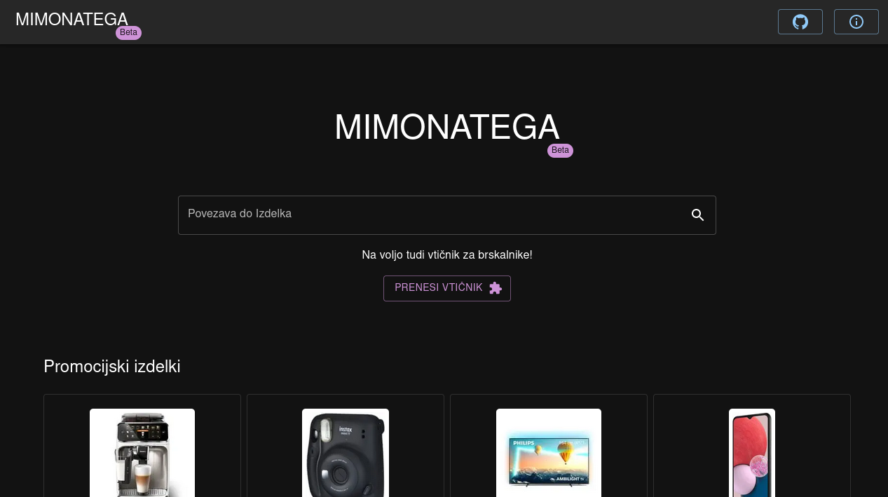

# Mimonatega-next

`Mimonatega-next` je implementacija spletnega mesta Mimonatega z uporabo tehnologije `Next.js` in `mui`.



# Mimonatega

Projekt `Mimonatega` je odprtokodni agregator cen iz spletne trgovine Mimovrste. Nastal je z namenom beleženja sprememb v cenah in popustih. Podatki so samodejno pridobljeni s periodicnim sprehajanjem (crawling) po spletnemu mestu mimovrste.com.

Projekt `Mimonatega` ni v nobenem smislu povezan z spletnim portalom Mimovrste in njihovimi storitvami.

Vsi pridobljeni podatki in pripadajoce slike so last podjetja MIMOVRSTE d.o.o.

Mimovrste.si in logotip Mimovrste sta blagovni znamki ali registrirani blagovni znamki MIMOVRSTE d.o.o..

## Postavitev

Zagon razvijalskega streznika:

```bash
npm run dev
# or
yarn dev
```

Odprite [http://localhost:3000](http://localhost:3000) z vasim brskalnikom.
